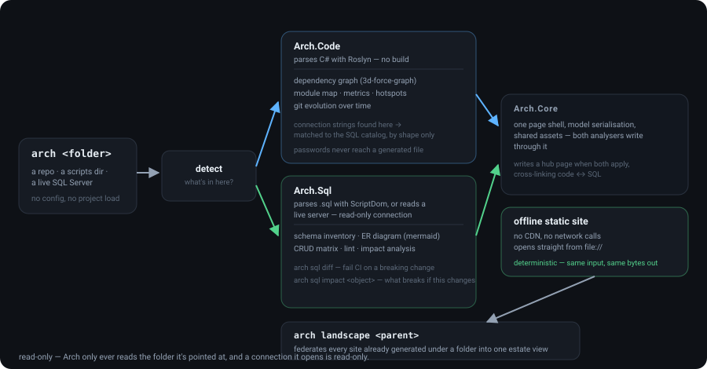
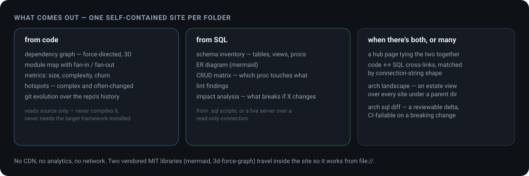

<div align="center">

# Arch

**Point it at a folder. Get a site that explains what's in there.**

Two static-site generators sharing one core and one `arch` executable: one reads source code
(dependency graphs, modules, metrics, hotspots, git evolution), one reads SQL (schema, ER
diagram, CRUD matrix, lint, impact). The output is a fully offline site — no CDN, no network,
opens straight from `file://`.

[](https://dotnet.microsoft.com)
[](https://github.com/jakoreilly/Arch/actions/workflows/ci.yml)
[](https://jakoreilly.github.io/Arch/)
[](LICENSE)

 is detected, then Arch.Code parses C# with Roslyn and Arch.Sql parses SQL with ScriptDom or reads a live server read-only; both write through Arch.Core's shared page shell into one offline static site; connection strings in code are matched to the SQL catalog by shape; arch landscape federates many sites into an estate view" width="100%">

</div>

---

## What it is

- **`Arch.Code`** (`archdiagram`) — analyses source code: dependency graphs, module maps,
  metrics, hotspots, git evolution. It reads the source; it never compiles it, and it does not
  need the target framework installed.
- **`Arch.Sql`** (`archsql`) — analyses `.sql` scripts, or connects to a live SQL Server
  read-only: schema inventory, ER diagram, CRUD matrix, lint, impact analysis.
- **`Arch.Cli`** (`arch`) — detects which applies to a folder and runs it; runs both and writes
  a hub page when both apply; cross-links code → SQL when a connection string in the code matches
  the SQL model's catalog. `arch landscape <parent>` federates the sites already generated under
  a folder into one estate view.

Output is a **fully offline** static site — no CDN, no network calls, opens straight from
`file://`. A [live demo](https://jakoreilly.github.io/Arch/) is on GitHub Pages.

## Why you'd want it

- **Land in an unfamiliar codebase and see its shape** before you've read a line — what depends
  on what, where the complexity clusters, which files everyone keeps touching.
- **Recover a database's design** that nobody wrote down — the ER diagram and CRUD matrix
  straight from the schema.
- **Diff architecture in review.** The output is byte-for-byte deterministic and `arch sql diff`
  can fail CI on a breaking schema change.
- **See a whole estate at once.** `arch landscape` rolls up every generated site under a parent
  directory.

---

## Install

`build.cmd`, or directly:

```bash
dotnet build Arch.slnx -c Release --nologo
```

That produces three executables under `src/*/bin/Release/net10.0/`: `arch.exe` (use this almost
always — it detects and does the right thing), `archdiagram.exe`, and `archsql.exe`. `arch code`
and `arch sql` are byte-for-byte equivalents of the standalone exes.

`run.cmd` wraps `arch.exe` — builds first if needed, takes a folder as an argument, a
drag-and-drop, or a prompt, and keeps the window open so you can read the result.

```
run.cmd C:\src\MyProject --out C:\reports\mine --no-open
```

Requires the **.NET SDK 10.0.300** or later.

## What you get



Full page-by-page reference, options, CI usage and the guarantees the output makes:
**[HOW-TO-USE.md](HOW-TO-USE.md)**. Just want a report out of a folder?
**[IDIOTS-GUIDE.md](IDIOTS-GUIDE.md)** — two double-clicks.

## The commands

```
arch <path> [options]                      detect content, generate the right site(s)
arch code <path> [options]                 force code analysis only
arch sql  <path> [options]                 force SQL analysis only
arch connect (--conn-file <p> | --env) …   read a live SQL Server, read-only
arch landscape <parent-dir> [options]      federate the sites already generated under a folder
```

Via `arch sql`, the rest of the SQL analyser is reachable:

```
arch sql --from-model <model.json> [--out <dir>]              rebuild a site from a saved model
arch sql --format <file-or-folder> [--check] [--dialect <d>]  format SQL (--check = verify only)
arch sql impact <schema.object> [--model <model.json>]        what breaks if this changes
arch sql diff <old.json> <new.json> [--fail-on breaking-change] [--baseline <f>]
```

---

## How it works

- **Detection** (`Arch.Cli`) decides whether a folder is code, SQL, or both, and dispatches.
  Forcing it with `arch code` / `arch sql` skips this step and is otherwise identical.
- **The code analyser** (`Arch.Code`) parses C# with Roslyn — syntax only, so a project that
  doesn't currently build is still fully analysable — and walks git history for the evolution
  view.
- **The SQL analyser** (`Arch.Sql`) parses scripts with `Microsoft.SqlServer.TransactSql.ScriptDom`,
  or reads a live catalog over a read-only connection.
- **`Arch.Core`** owns the HTML page shell, the model serialisation, and the shared assets. Both
  analysers write through it, which is what lets the hub page and the code ↔ SQL cross-links
  exist.
- **Determinism** is enforced, not hoped for: `tools/golden.sh` diffs generated output
  byte-for-byte against a checked-in baseline, and CI runs it on every push.

## Principles

- **Determinism is the product.** Same input, same bytes out — so the output is safe to commit,
  publish, and diff.
- **Read-only.** Both analysers only ever read the folder they're pointed at. `arch connect`
  opens a read-only connection. Nothing here writes to the source it analyses.
- **Secrets never reach the output.** Connection strings are detected and reported by *shape*;
  passwords never appear in any generated file, and the same is true of the vendored
  `assets/lib/LICENSES.txt` that must travel with a published site.

---

## Development

```bash
dotnet build Arch.slnx --nologo     # 0 warnings, 0 errors
dotnet test  Arch.slnx --nologo     # full test suite, ~90s
bash tools/golden.sh                # byte-identical-output regression check
```

```
src/Arch.Core/    shared HTML/page shell, model serialisation, detection, shared assets
src/Arch.Code/    the code analyser (Arch.Code.*)
src/Arch.Sql/     the SQL analyser (Arch.Sql.*)
src/Arch.Cli/     the unified `arch` executable
tests/            the test suites for each project
tools/golden.sh   the byte-identical-output regression net
```

## License

Apache License 2.0 — see [LICENSE](LICENSE) and [NOTICE](NOTICE). Copyright 2026 John O'Reilly.

Apache-2.0 rather than MIT for the express patent grant (§3) and the explicit statement that the
licence conveys no trademark rights (§6). If you redistribute Arch or a derivative, keep the
`NOTICE` file with it.

The sites Arch generates are yours; Arch claims nothing over its output. Each generated site does
carry two vendored MIT-licensed JavaScript libraries (`mermaid`, `3d-force-graph`), whose notices
travel with it in `assets/lib/LICENSES.txt` — leave that file in place when you publish a site.
Full detail: **[THIRD-PARTY-NOTICES.md](THIRD-PARTY-NOTICES.md)**.

---

<div align="center">
<sub>An arch makes a span whose shape you can read at a glance. So does this — for a folder you didn't write.</sub>
</div>
